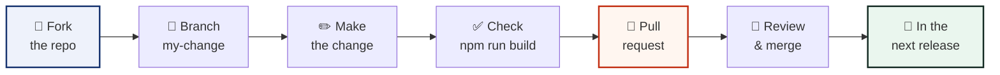

# Contributing to RUN STITCHCODE

Thank you for wanting to help! This guide is written for everyone — from
first-time helpers to seasoned engineers. Every kind of help counts: fixing a
word, drawing a diagram, reporting a bug, or writing code.

---

## The friendly rules

1. **Be kind.** The [Code of Conduct](./CODE_OF_CONDUCT.md) applies everywhere.
2. **One change per pull request.** Small changes are easy to review and merge.
3. **Plain words win.** The studio is made for 5th graders — the writing should
   be too. Short sentences. No jargon. Pictures when possible.
4. **If it scans, ship it.** Every change must keep codes scannable. The
   built-in decode test is the referee.

---

## How a change travels



### Step by step

```bash
# 1 · Fork on GitHub, then download YOUR copy
git clone https://github.com/YOUR-NAME/stitchcode.git
cd stitchcode

# 2 · Make a branch with a friendly name
git checkout -b fix-border-warning

# 3 · Install & start the studio
npm install
npm run dev

# 4 · Make the change, then check everything still works
npm run typecheck
npm run build

# 5 · Share it
git add .
git commit -m "fix: warn earlier when the border is too thin"
git push origin fix-border-warning
# …then press "Compare & pull request" on GitHub
```

---

## Good first jobs

| Badge on the issue | What it means |
|---|---|
| `good first issue` | A gentle start — perfect for a first pull request |
| `help wanted` | The maintainers would love a hand here |
| `docs` | Writing or drawing, no code needed |
| `bug` | Something is broken |
| `idea` | Something new to build |

Browse them under the **Issues** tab.

---

## Commit messages

The project uses [Conventional Commits](https://www.conventionalcommits.org/),
so the changelog can write itself:

```
fix:   stop the border warning from flickering
feat:  add a heart shape to the dot styles
docs:  draw the theme map for the wiki
chore: update the build robots
```

---

## The quality bar

Every pull request is checked automatically by the CI robot:

```
✅ typecheck   — the code speaks correct TypeScript
✅ build       — the whole studio assembles cleanly
✅ offline     — no new network calls allowed
✅ scannable   — sample codes must still decode
```

Before pushing, run the first two yourself:

```bash
npm run typecheck && npm run build
```

---

## Style notes (the short version)

- **Components** live in `src/components/`, clever logic in `src/lib/`.
- **Colours** come from theme tokens (`text-ink`, `bg-surface`), never raw hex
  in components — see [docs/THEMING.md](./docs/THEMING.md).
- **Icons** are from `lucide-react`; fonts stay self-hosted (zero network).
- **Motion** uses `motion/react` springs; always honour reduced motion.
- **Words** are for 5th graders. If a word needs a dictionary, pick another.

---

## Reporting a bug (no code needed!)

The fastest gift a helper can give is a great bug report:

1. Open a **New issue** → **Bug report**.
2. Say what you expected, what happened instead, and the steps to get there.
3. A picture or screen recording is worth a thousand words.

---

## Thank you

Every contributor — issue filers, word fixers, diagram drawers and coders —
makes the studio better for the next curious kid who opens it. 🙌
