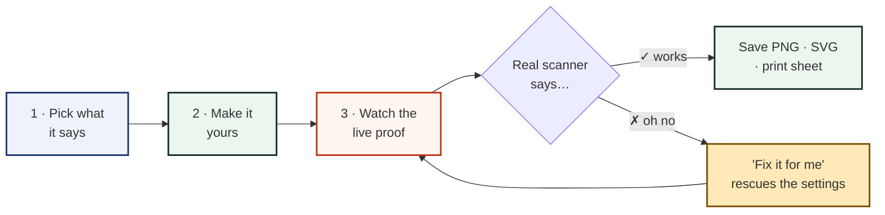
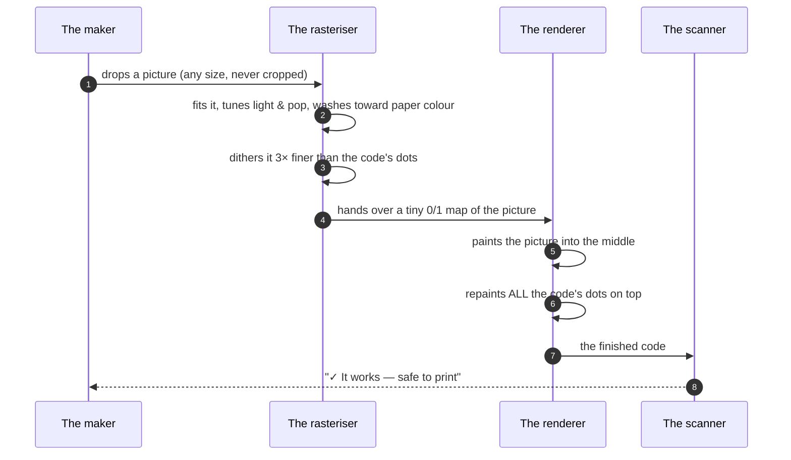

<div align="center">

# RUN STITCHCODE

### A friendly QR code studio that stitches your picture *into* the code — and checks that it really scans.

[](https://github.com/run-stitchcode/stitchcode/actions)
[](https://run-stitchcode.github.io/stitchcode/)
[](https://github.com/run-stitchcode/stitchcode/pkgs/container/stitchcode)
[](./LICENSE)
[](#why-it-is-safe)

</div>

---

## What is this?

**RUN STITCHCODE** is a web app where anyone — even a 5th grader — can build a
QR code in about one minute. It runs **entirely inside the browser**: there is no
server, no account, and nothing typed ever leaves the device.

Its signature trick is the **Stitch**: a picture is woven *under* the code's
dots instead of pasted on top, so the code stays 100% readable.

```
   your picture          fine halftone           code painted on top
  ┌────────────┐       ┌────────────┐          ┌────────────┐
  │            │       │ ▓░▒▓░░▒▓░░ │          │ ▓░▒▓░░▒▓░░ │
  │   (any     │  ──▶  │ ░▒▓░▒▓░░▒▓ │   ──▶    │ ░▒▓░▒▓░░▒▓ │  ◀ every dot is
  │   image)   │       │ ▒▓░░▒▓░▒▓░ │          │ ▒▓░░▒▓░▒▓░ │    still there
  └────────────┘       └────────────┘          └────────────┘
                        dithered 3× fine        scans perfectly ✓
```

And because promises need proof, the app **scans every code back with a real
decoder** before it lets anyone print it.

---

## Start in 30 seconds

Pick the path that fits — no coding needed for the first two:

| # | Path | Who it is for | What to do |
|---|------|---------------|------------|
| 🌐 | **Use it online** | Everyone | Open the GitHub Pages link (shown on the right of the repo) |
| 📲 | **Install it** | Everyone | Open the Pages link once → use your browser's **"Install app"** — it then works with no internet at all |
| 📦 | **Run the app file** | Helpers | Download the latest **Release** zip, unzip it, then run `npx serve .` (or `python3 -m http.server`) in that folder and open the link it prints |
| 🐳 | **Run with Docker** | Helpers | `docker run -p 8080:80 ghcr.io/run-stitchcode/stitchcode` → open `localhost:8080` |
| 🛠️ | **Build from source** | Curious makers | Follow the three commands below |

> 💡 **Why can't I just double-click `index.html`?** Modern web apps are built
> from many small files that browsers refuse to load straight from a folder for
> safety. A tiny local server (one command) or Docker fixes it — no coding needed.

```bash
# 1. get the code        (or download the green "Code" zip instead)
git clone https://github.com/run-stitchcode/stitchcode.git
cd stitchcode

# 2. install the parts   (Node.js 22+ needed — https://nodejs.org)
npm install

# 3. start the studio
npm run dev              # then open the link it prints (usually :5173)
```

> **Stuck?** The [Troubleshooting wiki page](https://github.com/run-stitchcode/stitchcode/wiki/Troubleshooting) fixes
> the five most common bumps, in pictures.

---

## What the studio can do



| Feature | What it means in plain words |
|---|---|
| **7 ways to share** | Links, messages, Wi-Fi, contact cards, e-mail, texts, phone numbers |
| **Stitch a picture in** | A photo or logo becomes part of the code — from a tiny badge to 100% full-bleed |
| **Three art styles** | Photo-soft (dither), comic-screen (halftone), or razor-crisp |
| **Five colour themes** | Whole studio re-skins instantly; choice is remembered on the device |
| **Paper & fabric previews** | See the code on paper, kraft, knit, cotton or nylon before printing |
| **Print-shop magnifier** | Hover the proof to inspect single dots, like a loupe |
| **Scan-safety report** | Border, contrast, colours and density are checked while typing |
| **Real decode test** | The app scans the code back itself and reports ✓ or ✗ |
| **Print proof sheet** | Crop-marked, true-size sheet with a 2 cm minimum check |
| **Saved builds** | History lives only on the device — close the tab, come back, it's there |
| **Works offline** | Zero network calls once loaded; fonts and scanner travel with the app |

---

## How a picture gets stitched in (the deep part)

This is the heart of the project. Two techniques, one rule: **the special
squares are never touched.**



**What is protected, and why it matters:**

```
  ■ ■ ■ ■ ■ ■ ■  .  □ □ □ □ □  .  ■ ■ ■ ■ ■ ■ ■     ■ = corner square
  ■ □ □ □ □ □ ■  .  ■ □ ■ □ ■  .  ■ □ □ □ □ □ ■     □ = its light ring
  ■ □ ■ ■ ■ □ ■  .  □ ■ □ ■ □  .  ■ □ ■ ■ ■ □ ■     ▓ = timing line
  ■ □ ■ ■ ■ □ ■  .  ■ □ ■ □ ■  .  ■ □ ■ ■ ■ □ ■     ◉ = straighten dot
  ■ □ □ □ □ □ ■  .  □ ■ □ ■ □  .  ■ □ □ □ □ □ ■     · = your message
  ■ ■ ■ ■ ■ ■ ■  .  ■ □ ■ □ ■  .  ■ ■ ■ ■ ■ ■ ■
  .  .  .  .  .  .  .  .  .  .  .  .  .  .  .
  ▓ □ ▓ □ ▓ □ ▓ □ ▓ □ ▓ □ ▓ □ ▓ · · · · · ·
  .  .  .  .  .  .  .  .  .  .  .  .  .  .  .
  ■ ■ ■ ■ ■ ■ ■  .  ▓ □ ▓ □ ▓  .  ◉ ◉ ◉ ◉ ◉
  ■ □ □ □ □ □ ■  .  □ · · · ·  .  ◉ □ □ □ ◉
  ■ □ ■ ■ ■ □ ■  .  · · · · ·  .  ◉ □ ■ □ ◉
  ■ □ ■ ■ ■ □ ■  .  · · P · ·  .  ◉ □ □ □ ◉
  ■ □ □ □ □ □ ■  .  · · · · ·  .  ◉ ◉ ◉ ◉ ◉
  ■ ■ ■ ■ ■ ■ ■  .  ▓ □ ▓ ▓ ▓  .  ▓ □ ▓ □ ▓
```

| Part | Plain name | What happens to it when stitching |
|---|---|---|
| `■` corners | Corner squares | Untouched — cameras look for these first |
| `▓` lines | Counting lines | Untouched — they measure the grid |
| `◉` target | Straighten dot | Untouched — fixes bent or angled codes |
| `· · P · ·` | **Your picture** | Lives here — only plain message dots move |

> Cameras can't guess these special squares if they change, so the studio
> treats them like museum glass: look, don't touch. That is exactly why a
> stitched code still scans.

---

## The five golden scanning rules

The studio enforces these live — but they are worth knowing by heart:

| # | Rule | The picture version |
|---|------|---------------------|
| 1 | Leave a clear border (≥ 4 squares) | `▢▢▢▢▢▢▢▢▢▢`<br>`▢ ▓▓▓▓▓▓▓▓ ▢`<br>`▢ ▓▓▓▓▓▓▓▓ ▢`<br>`▢▢▢▢▢▢▢▢▢▢` |
| 2 | Dark code on light paper | ✅ `▓▓` on `░░` &nbsp;·&nbsp; ❌ `░░` on `▓▓` |
| 3 | Print at least 2 cm wide | `▓▓▓▓▓▓▓▓` ≈ a thumb tip |
| 4 | Turn safety up for print | Level H survives sticky fingers |
| 5 | Always test the real print | Two phones, one dim room |

The full, illustrated guide lives in
**[docs/SCAN_SAFETY.md](./docs/SCAN_SAFETY.md)**.

---

## The five themes

One click re-skins the whole studio. The choice is remembered on the device.

| Theme | Paper | Ink | Signal | Swatch |
|---|---|---|---|---|
| **Comelea Alpine** *(default)* | `#F0EEDF` | `#1C1C1A` | `#FE492A` | 🟥⬛🟨 |
| **Teal Wave & Lagoon** | `#D9FAF4` | `#0F2A2A` | `#00BFA6` | 🟩⬛⬜ |
| **Fresh Mint & Pine Shadow** | `#DFF8EB` | `#132A22` | `#19C37D` | 🟩⬛⬜ |
| **Spring Chartreuse** | `#F6F7ED` | `#001F3F` | `#DBE64C` | 🟨🟦⬜ |
| **Midnight Cinnabar** | `#FAF5F5` | `#191815` | `#E84528` | 🟥⬛⬜ |

Theme builders: the full token map is in **[docs/THEMING.md](./docs/THEMING.md)**.

---

## Project map

```
stitchcode/
├── index.html              ← the front door
├── src/
│   ├── App.tsx             ← glue: pages, history, themes
│   ├── main.tsx            ← lights on (fonts bundled locally)
│   ├── index.css           ← the five theme wardrobes
│   ├── components/         ← the visible parts
│   │   ├── ContentForms    ← "what it says"
│   │   ├── StylePanel      ← "make it yours" + picture stitching
│   │   ├── PreviewPanel    ← live proof, scan report, exports
│   │   ├── Sections        ← tips, anatomy lesson, questions
│   │   └── ui              ← buttons, toasts, tooltips
│   └── lib/                ← the clever bits (all offline)
│       ├── qr              ← encoder + stitch/inlay renderers
│       ├── useLogoGrid     ← picture → 0/1 map
│       ├── decode          ← the real scanner (lazy-loaded)
│       ├── payloads        ← the 7 ways to share
│       ├── themes          ← the five wardrobes
│       └── sample          ← the bundled sample picture
├── docs/                   ← illustrated guides
├── wiki/                   ← wiki pages (copy into the repo wiki)
└── .github/                ← robots: CI, Pages, releases, Docker
```

## Why it is safe

```mermaid
flowchart LR
  subgraph your device["Your device — everything happens here"]
    A[typing] --> B[encoding] --> C[scanning back] --> D[saving]
  end
  subgraph internet["The internet"]
    Z(("nothing<br/>sent ✗"))
  end
  your device -.->|"0 requests"| Z

  style Z fill:#fff0f0,stroke:#c22e12,stroke-width:2px
```

- **No account, no tracker, no analytics.** Fonts and the scanner are bundled
  inside the app.
- **History and theme choice** live only in the browser's local storage.
- Found something scary? The [security policy](./SECURITY.md) explains the
  private way to report it.

---

## For makers

| Want to… | Go here |
|---|---|
| Help improve the studio | [CONTRIBUTING.md](./CONTRIBUTING.md) |
| Understand every part | [docs/HOW_IT_WORKS.md](./docs/HOW_IT_WORKS.md) |
| Host it yourself | [docs/SELF_HOSTING.md](./docs/SELF_HOSTING.md) |
| Ship it to production | [docs/PRODUCTION_CHECKLIST.md](./docs/PRODUCTION_CHECKLIST.md) |
| Read the wiki | [the wiki](https://github.com/run-stitchcode/stitchcode/wiki) |
| See what changed when | [CHANGELOG.md](./CHANGELOG.md) |

The robots already know what to do: pushing to `main` runs the checks,
publishes the Pages site, and tagging `v1.2.3` builds a Release **and** a
Docker image.

---

## Licence

Shared under the [MIT licence](./LICENSE) — take it, learn from it, make it
yours. Built with React, Vite and Tailwind, and a lot of care.

<div align="center">

**Made for curious people of every age. If it scans, ship it. ✓**

</div>
