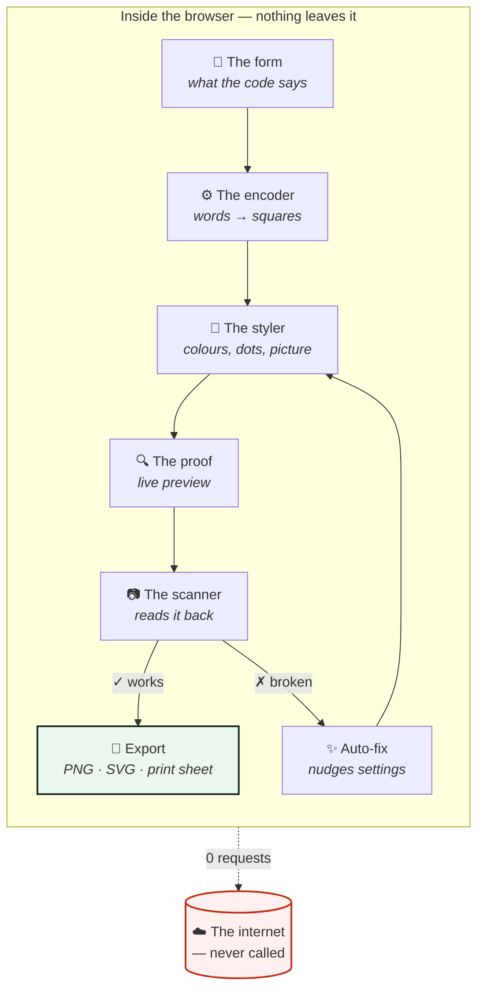
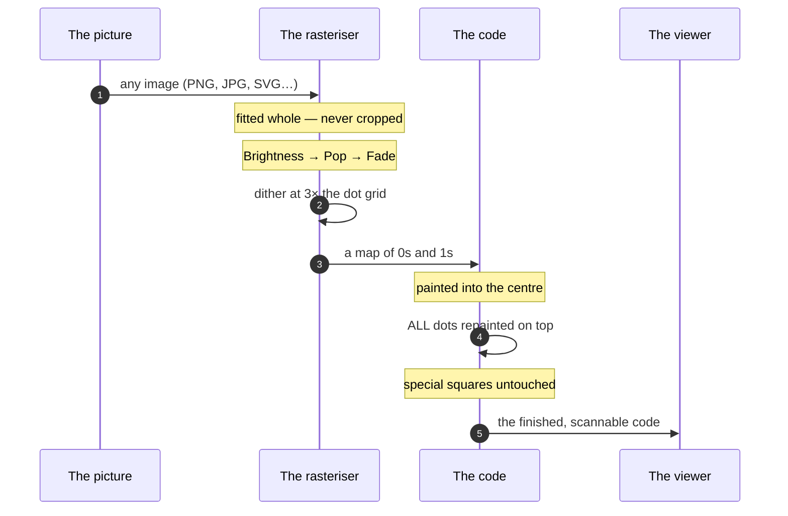
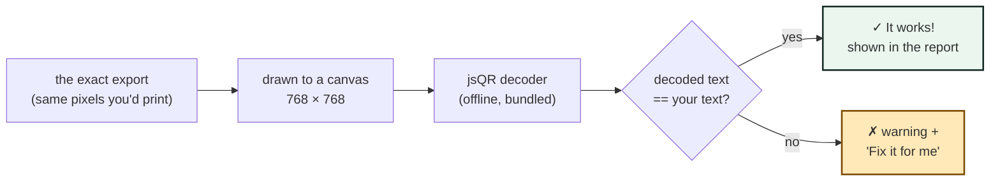
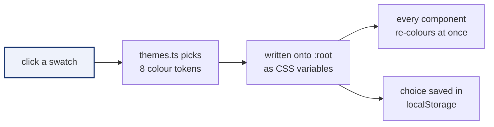

# How RUN STITCHCODE works

A picture-tour of everything that happens between typing a link and holding a
printed code. No prior knowledge needed — every diagram tells the whole story.

---

## 1 · The big picture



Every box above is a real file:

| Box on the diagram | File |
|---|---|
| 📝 The form | `src/components/ContentForms.tsx` + `src/lib/payloads.ts` |
| ⚙️ The encoder | `src/lib/qr.ts` (built on the `qrcode` engine) |
| 🎨 The styler | `src/components/StylePanel.tsx` + `src/lib/useLogoGrid.ts` |
| 🔍 The proof | `src/components/PreviewPanel.tsx` |
| 📷 The scanner | `src/lib/decode.ts` (jsQR, loaded only when needed) |
| ✨ Auto-fix | the `autoFix` helper in `src/App.tsx` |

---

## 2 · How words become squares

```
 "stitchcode.run"                          a v4 code (33×33 squares)
 ───────────────                          ─────────────────────────
 1. count the letters ──▶ pick the smallest code that fits
 2. translate letters ──▶ into a stream of 0s and 1s
 3. add safety bits   ──▶ level H (survives ~30% damage)
 4. paint the pattern ──▶ dark = 1, light = 0
```

The safety level is a trade-off, shown visually:

```
 level L   ▓▓▓▓▓▓▓▓▓▓░░░░░░░░░░  roomy, but fragile
 level M   ▓▓▓▓▓▓▓▓▓▓▓▓▓▓░░░░░░  a fair balance
 level Q   ▓▓▓▓▓▓▓▓▓▓▓▓▓▓▓▓░░░░  print-friendly
 level H   ▓▓▓▓▓▓▓▓▓▓▓▓▓▓▓▓▓▓▓▓  tough — needed for pictures
```

---

## 3 · How the picture gets stitched in

This is the signature move, step by step:



### The two techniques, side by side

```
 STITCH (default)                      INLAY
 ───────────────                       ───────────────
 picture under EVERYTHING              picture REPLACES dots
 code repainted on top                 level H restores them
 safe at 100% size                     keep it ≤ ~50% wide

 ┌─────────────┐                       ┌─────────────┐
 │ ▓░▒▓░░▒▓░░▒ │                       │ ▓░▒   ▓░░▒  │
 │ ░▒▓░▒▓░░▒▓░ │                       │ ░▒▓   ░▒▓░  │
 │ ▒▓░░▒▓░▒▓░░ │                       │ ▒▓░░▒▓░▒▓░░ │
 └─────────────┘                       └─────────────┘
 nothing erased ✓                      bolder look ✂
```

### What is never touched

```
  ┌─────────┐                    ┌─────────┐
  │ CORNER  │    · · · · · · ·   │ CORNER  │   corners = "I'm a code!"
  │ SQUARE  │    · timing  ·     │ SQUARE  │   timing  = the ruler
  └─────────┘    · · · · · · ·   └─────────┘
      ·          ┌─────────┐         ·
      · format → │ PICTURE │ ← alignment
      ·          └─────────┘         ·
  ┌─────────┐    · · · · · · ·   ┌─────────┐
  │ CORNER  │    · dark      ·   │ version │   (big codes only)
  │ SQUARE  │    · module    ·   └─────────┘
  └─────────┘    · · · · · · ·
```

| Part | If it gets damaged… | So the studio… |
|---|---|---|
| Corner squares | the code is invisible | never paints over them |
| Timing lines | the grid is miscounted | keeps them solid |
| Alignment dot | bent codes fail | keeps it solid |
| Version block (big codes) | **no backup exists** | keeps it exactly as encoded |
| Format ring | cameras misread settings | keeps it exactly as encoded |

---

## 4 · How "✓ It works" is proven

The studio does not *guess* — it scans:



The decoder loads lazily (its own file, fetched once) so the studio opens fast.

---

## 5 · How themes work



Components never see raw colours — they use names like `bg-surface` and
`text-ink`, which point at whichever theme is wearing the wardrobe. Full map in
[THEMING.md](./THEMING.md).

---

## 6 · What ships to the browser

```
 dist/
 ├── index.html        ← the page
 ├── assets/
 │   ├── index-*.js    ← the studio (code-split: decoder is separate)
 │   ├── index-*.css   ← the five theme wardrobes
 │   └── *.woff2       ← self-hosted fonts (Inter + JetBrains Mono)
 └── robots.txt
```

Total requests when opened: **just these files. Then zero.**
