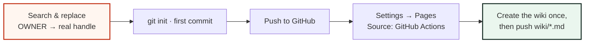
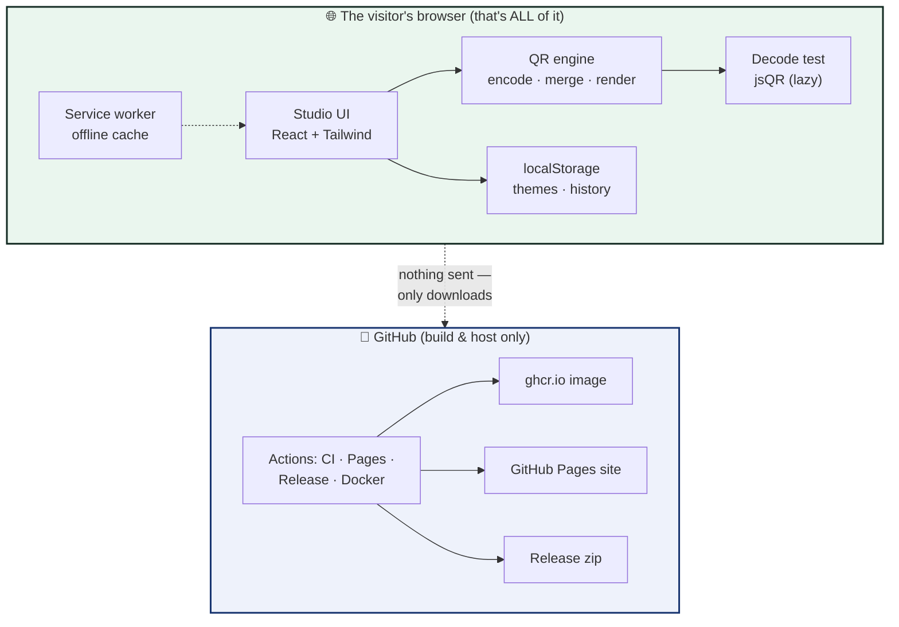

# ✅ Production Readiness Checklist

A visual, tick-off-able list for whoever ships RUN STITCHCODE to the world.
Everything below is already wired — this is the *verification* pass.

---

## Phase 1 · Before the first push



- [ ] Replace every `OWNER` with the real GitHub handle
      (badges, URLs, `docker run`, CODEOWNERS, wiki links)
- [ ] `.gitignore`, `LICENSE`, `README`, `CHANGELOG` present
- [ ] First push triggers the **CI** workflow → both Node jobs pass
- [ ] Pages source switched to **GitHub Actions** → site goes live
- [ ] Wiki initialised on GitHub, then `wiki/*.md` pushed to `stitchcode.wiki.git`

## Phase 2 · First release

- [ ] `git tag v1.0.0 && git push --tags`
- [ ] Release workflow publishes a **zip** (portable, relative-base) ✔
- [ ] Docker workflow publishes **ghcr.io/OWNER/stitchcode:1.0.0** ✔
- [ ] `CHANGELOG.md` already lists 1.0.0 (it does)

## Phase 3 · Smoke-test the live studio

| # | Test | Pass when… |
|---|------|-----------|
| 1 | Load the Pages URL | studio renders, fonts load (offline bundle) |
| 2 | Build a code, watch the checks | all rows green, "✓ ready to scan" |
| 3 | **Decode test** says "It works!" | a real decoder read it back |
| 4 | Download PNG + SVG | files save & re-scan |
| 5 | Print proof → browser print dialog | only the paper prints |
| 6 | Switch all 5 themes + shuffle | recolours instantly, choice persists on reload |
| 7 | Drop a picture → Stitch at 100% | full-bleed photo QR, still decodes |
| 8 | DevTools → Network → **Offline** → reload | app still works (service worker) |
| 9 | Browser menu → **Install app** | installs, opens standalone |
| 10 | Restore a build from history | settings + stitched logo come back |

## Phase 4 · Ongoing maintenance

```
  Dependabot ──▶ bumps deps/Actions/Docker weekly (grouped, low-noise)
  Security   ──▶ private advisories, 48h ack (see SECURITY.md)
  Versions   ──▶ bump CHANGELOG + sw.js VERSION on each release
  Themes     ──▶ keep small-text contrast ≥ 4.5:1 (see docs/THEMING.md)
```

- [ ] Watch Dependabot PRs; merge after CI passes
- [ ] On every release: bump `VERSION` in `public/sw.js` so visitor caches refresh

---

## One-glance architecture



**The golden invariant:** the browser never *sends* data. GitHub is a
vending machine (it hands the app down); it never receives anything back.
