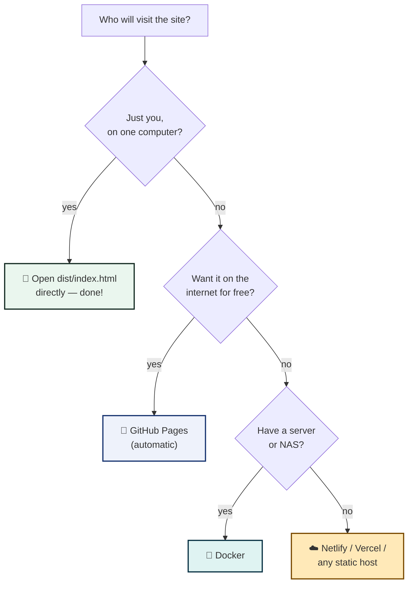

# Hosting RUN STITCHCODE Yourself

The studio is a plain folder of static files, so it runs almost anywhere.
Pick a path — each one is drawn out below.

---

## Which path fits?



---

## Path 1 · GitHub Pages (automatic)

The repository already contains the robot (`.github/workflows/pages.yml`).
One switch turns it on:

```
 1. Open the repo on GitHub
 2. Settings → Pages
 3. "Build and deployment" → Source:  GitHub Actions
 4. Push anything to main
 5. ☕ wait a minute → the link appears in the same place
```

| Pro | Con |
|---|---|
| Free forever | Public repo = public site |
| Updates itself on every push | `OWNER.github.io/stitchcode` URL |
| No servers to babysit | (custom domains supported) |

---

## Path 2 · Docker (one command)

A ready image is published to GitHub Packages on every release.

```bash
# pull & run — the whole studio on port 8080
docker run -d -p 8080:80 --name stitchcode ghcr.io/OWNER/stitchcode

# open http://localhost:8080
```

Or build it from source (recipe included as `Dockerfile` + `nginx.conf`):

```bash
docker compose up --build      # → http://localhost:8080
```

The image is a two-layer sandwich: the studio baked with Node, served by a
tiny hardened nginx (read-only filesystem, gzip, long-lived asset caches,
safety headers).

---

## Path 3 · Any static host

Build once, drop the `dist/` folder anywhere:

```bash
npm install
npm run build -- --base=./     # the ./ keeps paths relative
```

| Host | How |
|---|---|
| **Netlify** | drag the `dist/` folder onto app.netlify.com/drop |
| **Vercel** | import the repo; build `npm run build`, output `dist` |
| **Cloudflare Pages** | same as Vercel; framework preset "Vite" |
| **Any web server** | upload the contents of `dist/` to the web root |

> The `--base=./` flag matters on hosts that serve the site from a sub-folder.

---

## Path 4 · Fully offline, no browser server

Because the app makes **zero network calls**, the built folder even works from
a USB stick:

```
 1. npm run build -- --base=./
 2. copy dist/ onto the stick
 3. on any computer: open dist/index.html
```

History and theme choice live in that browser's local storage, so each
computer keeps its own.

---

## After hosting: the 10-second smoke test

```
 □ the studio opens and fonts look right
 □ type a link → a code appears instantly
 □ "We scanned it for you" says ✓
 □ Save image downloads a PNG
 □ refresh → history is still there
```

If any box stays empty, the [wiki troubleshooting page](../wiki/Troubleshooting.md)
has the fixes.
