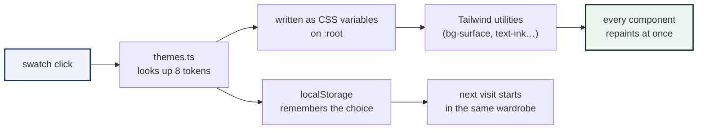

# The Theme System

Five wardrobes, one closet. Every colour in the studio comes from a small set
of named tokens, so swapping a theme is just changing eight values.

---

## How a click becomes a recolour



---

## The token map

| Token | What it paints | Example (Comelea Alpine) |
|---|---|---|
| `--t-bg` | the page canvas | `#F0EEDF` cream |
| `--t-surface` | cards & panels | whitish cream |
| `--t-surface2` | nested panels | soft sand |
| `--t-ink` | headings, borders, shadows | `#1C1C1A` charcoal |
| `--t-ink-dim` | body text | warm grey |
| `--t-accent` | primary buttons | `#FE492A` vermillion |
| `--t-accent2` | deep secondary (rails, icons) | `#16336F` navy |
| `--t-ok / warn / danger` | ✅ ⚠️ ❌ states | green / amber / red |

Components never use raw hex colours — they speak token names, which is why a
theme swap never leaves a stray pixel behind.

---

## The five palettes

| Name | Canvas | Ink | Accent | Secondary |
|---|---|---|---|---|
| Comelea Alpine | `#F0EEDF` | `#1C1C1A` | `#FE492A` | `#16336F` |
| Teal Wave & Lagoon | `#D9FAF4` | `#0F2A2A` | `#00BFA6` | `#0F2A2A` |
| Fresh Mint & Pine Shadow | `#DFF8EB` | `#132A22` | `#19C37D` | `#132A22` |
| Spring Chartreuse (MP076) | `#F6F7ED` | `#001F3F` | `#DBE64C` | `#1E488F` |
| Midnight Cinnabar | `#FAF5F5` | `#191815` | `#E84528` | `#005151` |

All five were tuned so that **small text keeps ≥ 4.5 : 1 contrast** on its
canvas — the WCAG AA line the scan report borrows for QR contrast too.

---

## Making a sixth theme

Three steps, no components touched:

```ts
// 1 · add the palette to src/lib/themes.ts
export const THEMES: Theme[] = [
  …,
  {
    id: "sunset",
    name: "Sunset Pier",
    bg: "#FFF1E6", ink: "#2B1B17",
    accent: "#FF6B35", accent2: "#7A4A00", …
  },
];
```

```css
/* 2 · nothing to add — tokens are written at runtime */
```

```ts
// 3 · done. The swatch appears in the header automatically.
```

The shuffle button and persistence pick new themes up for free.

---

## Design rules the themes obey

| Rule | Why |
|---|---|
| Light canvases only | the studio is for screens *and* print previews |
| Ink is near-black, never pure `#000` | softer on eyes, same scan contrast |
| Accent2 is dark on every palette | it carries text-weight jobs (rails, links) |
| Shadows are hard offset, not blurred | the project's signature "pressable" feel |
| Colours change, layout never does | themes are wardrobe swaps, not rebuilds |
