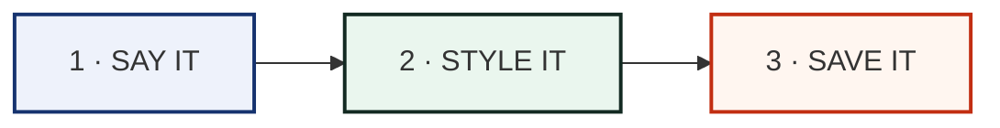

# 🚀 Getting Started

Build your first code in about one minute. Three steps, that's all.



---

## Step 1 · Say it

Open the studio and pick what your code should share:

| Tab | Shares a… | Great for |
|---|---|---|
| 🔗 Link | website | posters, slides |
| 💬 Text | any message | secret notes! |
| 📶 Wi-Fi | network login | cafés, guests |
| 👤 Card | contact info | name badges |
| ✉️ E-mail | a ready e-mail | help desks |
| 💬 Message | an SMS | events |
| 📞 Phone | a number to call | shops |

> **No idea what to type?** Press a **Quick Idea** chip — or hit
> **Surprise me!** and the studio fills the form for you.

---

## Step 2 · Style it

The middle card makes it yours:

- **Colours** — tap a Quick colour, or swap code/paper colours.
- **Dots** — square, round or dotty; corners round or square.
- **Picture** — press *Try a sample* or drop your own image. Then:
  - *How big* slides it from a small badge to the whole code,
  - *Fade* softens busy pictures so the code stays boss.
- **Safety level** — going on paper? Choose **Q** or **H**.

Everything you touch changes the proof **on the right, instantly**.

---

## Step 3 · Save it

Watch the **Scan checks** list. When it says:

```
 ✓ Clear border        ✓ Contrast        ✓ Colour direction
 ✓ Your picture        ✓ How busy        ✓ We scanned it for you
```

…the code has earned its badge. Now:

| Button | Gives you |
|---|---|
| **Save image** | a PNG, ready for screens & printers |
| **Save SVG** | a vector file that never blurs |
| **Print it** | a crop-marked proof sheet with a 2 cm test code |

That's it — you made a real, verified QR code. 🎉

---

## What happens to your work?

```
 your words ──▶ stay in YOUR browser ──▶ saved builds appear below the studio
                  │
                  └── never sent anywhere. close the tab, they're still there.
```
