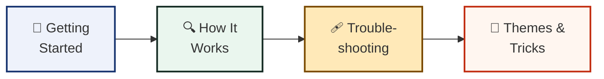

# 👋 Welcome to the RUN STITCHCODE wiki!

This is the friendly corner of the project — short pages, big pictures,
written for people who have never written a line of code.



## Jump right in

| If you want to… | Read |
|---|---|
| Build your first code in one minute | [Getting Started](./Getting-Started) |
| See what happens inside the studio | [How It Works](./How-It-Works) |
| Fix something that's acting up | [Troubleshooting](./Troubleshooting) |
| Make codes beautiful *and* scannable | [Themes & Tricks](./Themes-and-Tricks) |

## For wiki maintainers

The pages in the repository's `wiki/` folder are the source of truth. To
publish them to this wiki, run the one-command helper from the repo root:

```bash
make wiki-init        # clones the wiki repo, copies wiki/*.md, pushes
```

(Manual equivalent: clone `https://github.com/hateem2121/stitchcode.wiki.git`,
copy `wiki/*.md` into it, commit and push.)

`_Sidebar.md` and `_Footer.md` are special GitHub-wiki files that build the
navigation you see on the right.
