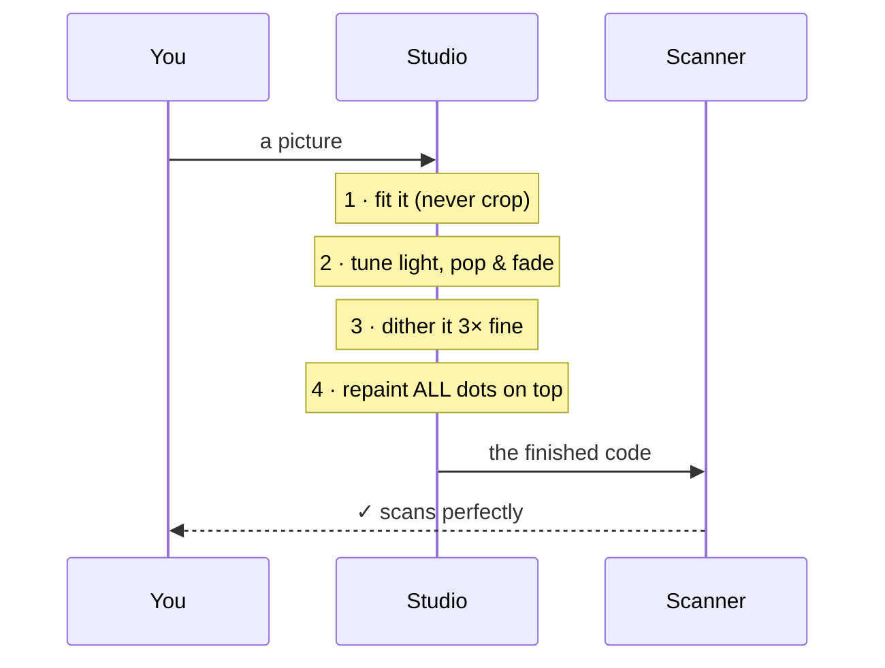

# 🔍 How It Works (the picture version)

The full, illustrated guide lives in the repository at
[`docs/HOW_IT_WORKS.md`](https://github.com/RUN-APPAREL/stitchcode/blob/main/docs/HOW_IT_WORKS.md).
Here is the postcard version.

---

## The one-minute tour

```
  YOU                     THE STUDIO                    THE PROOF
  ───                     ──────────                    ─────────
  type a link      ──▶    letters → 0s & 1s      ──▶    squares appear
  pick colours     ──▶    squares get dressed    ──▶    proof re-colours
  drop a picture   ──▶    picture → tiny map     ──▶    picture weaves in
  press save       ──▶    scanner reads it back  ──▶    "✓ It works!"
```

## The stitch, in one diagram



## The golden rule

The code's **special squares** (three corners, the ruler lines, the
straighten dot) are like the bones of a body — the picture may colour the
skin, but the bones are never touched. That is why stitched codes still scan.

```
  ┌─────┐ · · · · · · ┌─────┐
  │bone │ · timing  · │bone │
  └─────┘ · · · · · · └─────┘
  · · · · ┌─────────┐ · · · ·
  · ruler │ PICTURE │ · ◉ dot
  · · · · └─────────┘ · · · ·
  ┌─────┐ · · · · · · ┌─────┐
  │bone │ · version · │name │
  └─────┘ · · · · · · └─────┘
```

## Deep-dive pages

| Topic | Where |
|---|---|
| Every box in the pipeline | [`docs/HOW_IT_WORKS.md`](https://github.com/RUN-APPAREL/stitchcode/blob/main/docs/HOW_IT_WORKS.md) |
| The six scanning rules | [`docs/SCAN_SAFETY.md`](https://github.com/RUN-APPAREL/stitchcode/blob/main/docs/SCAN_SAFETY.md) |
| Colours & themes | [`docs/THEMING.md`](https://github.com/RUN-APPAREL/stitchcode/blob/main/docs/THEMING.md) |
| Hosting it yourself | [`docs/SELF_HOSTING.md`](https://github.com/RUN-APPAREL/stitchcode/blob/main/docs/SELF_HOSTING.md) |
