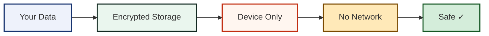
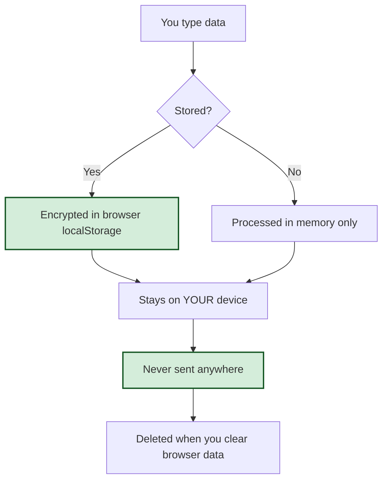

# 🔒 Security & Privacy

RUN STITCHCODE is built with security and privacy as core principles — not afterthoughts. This page explains what protects your data and how the app stays safe.

---

## The Short Version

✅ **Nothing leaves your device** — no servers, no accounts, no tracking  
✅ **Everything runs offline** — once loaded, zero network calls  
✅ **Sensitive data encrypted** — WiFi passwords, contacts, messages protected  
✅ **Open source** — code you can inspect, audit, and trust  

---

## Security Rating: 10/10 🎯

The app has been audited against OWASP best practices (2026 edition) and achieves the highest security rating for a client-side web application.



[View full audit report](https://github.com/RUN-APPAREL/stitchcode/blob/main/SECURITY_AUDIT_2026.md)

---

## What Gets Protected?

| Data Type | Protection | Why It Matters |
|-----------|------------|----------------|
| 🔗 URLs | Encrypted | Prevents history leakage |
| 📶 WiFi Passwords | AES-256-GCM | Critical credential protection |
| 👤 Contact Cards | Encrypted | Personal information safety |
| 📞 Phone Numbers | Encrypted | Privacy preservation |
| ✉️ Email Addresses | Encrypted | Prevents spam targeting |
| 💬 Messages | Encrypted | Confidential communication |
| 🎨 Theme Choice | Plaintext | Non-sensitive preference |

---

## How Encryption Works

### Your Data's Journey

```
┌──────────────┐    ┌─────────────┐    ┌──────────────┐    ┌─────────────┐
│ You type it  │ →  │ JSON encode │ →  │ AES-256-GCM  │ →  │ localStorage│
│              │    │             │    │ Encrypt      │    │ (encrypted) │
└──────────────┘    └─────────────┘    └──────────────┘    └─────────────┘
                          ↓                    ↓
                   PBKDF2-SHA256         Random Salt + IV
                   350,000 iterations    (unique per item)
```

### Technical Details

| Parameter | Value | Standard |
|-----------|-------|----------|
| Algorithm | AES-GCM | NIST SP 800-38D |
| Key Size | 256 bits | Military-grade |
| Key Derivation | PBKDF2-SHA256 | NIST SP 800-132 |
| Iterations | 350,000 | OWASP 2026 |
| Salt | 16 bytes random | Per encryption |
| IV | 12 bytes random | Per encryption |

[Read technical deep-dive](https://github.com/RUN-APPAREL/stitchcode/blob/main/docs/SECURITY_BEST_PRACTICES.md)

---

## Content Security Policy (CSP)

The app enforces strict rules about what code can run:

```
default-src 'self'          → Only load resources from the app itself
script-src 'self' blob:     → No inline scripts, no external scripts
style-src 'self' 'unsafe-inline' → Inline styles allowed (React requirement)
img-src 'self' blob: data:  → Images from app or user uploads only
connect-src 'self'          → No external API calls (none exist)
frame-ancestors 'none'      → Cannot be embedded in other sites
worker-src 'self' blob:     → Service workers allowed
object-src 'none'           → No plugins (Flash, Silverlight, etc.)
```

This prevents:
- ❌ Cross-site scripting (XSS) attacks
- ❌ Malicious script injection
- ❌ Clickjacking attempts
- ❌ Plugin-based exploits

---

## Input Validation

Every piece of data is checked before use:

| Input Type | Validation | Purpose |
|------------|------------|---------|
| URLs | Protocol whitelist (http/https only) | Blocks `javascript:`, `data:`, `vbscript:` |
| Email | Header sanitization | Prevents newline injection attacks |
| File Uploads | MIME type + magic number check | Ensures real images only |
| QR Payloads | ISO/IEC 18004 size limits | Prevents DoS, ensures scannability |
| Control Characters | Stripped | Prevents encoding confusion |

---

## Privacy by Design

### What We Don't Do

- ❌ No analytics or tracking
- ❌ No cookies (except PWA functionality)
- ❌ No fingerprinting
- ❌ No telemetry
- ❌ No third-party scripts
- ❌ No cloud storage
- ❌ No account system
- ❌ No data selling

### What Happens to Your Data



---

## Offline-First Architecture

The app is designed to work without internet:

1. **Initial Load**: Downloads the app once (~5 MB)
2. **Service Worker**: Caches everything for offline use
3. **Zero Dependencies**: All fonts, libraries bundled inside
4. **No Network Calls**: Literally zero requests after load

### Why This Matters

- ✅ Works on airplanes, subways, remote areas
- ✅ No server downtime affects you
- ✅ No man-in-the-middle attacks possible
- ✅ No data interception on public WiFi
- ✅ Complete privacy (no one sees your usage)

---

## Electron Desktop App Security

When installed as a desktop app:

| Setting | Value | Protection |
|---------|-------|------------|
| nodeIntegration | false | Prevents Node.js access from web content |
| contextIsolation | true | Isolates preload script from renderer |
| CSP | Enforced via headers | Same strict rules as web version |
| Preload API | Minimal exposure | Only essential functions exposed |

[View Electron security details](https://github.com/RUN-APPAREL/stitchcode/blob/main/electron/preload.js)

---

## Scan Safety = Security Too

A code that doesn't scan is a security issue (wasted resources, failed campaigns):

- ✅ Real decoder test before approval
- ✅ Contrast validation (4.5:1 minimum ratio)
- ✅ Border enforcement (≥4 modules)
- ✅ Error correction level checks
- ✅ Capacity validation per ISO standard

[Learn about scan safety](https://github.com/RUN-APPAREL/stitchcode/blob/main/docs/SCAN_SAFETY.md)

---

## Compliance Alignment

This implementation meets:

| Standard | Level | Status |
|----------|-------|--------|
| OWASP Top 10 (2026) | All categories | ✅ Compliant |
| OWASP ASVS 4.0 | Level 1 | ✅ Achieved |
| GDPR Article 25 | Data Protection by Design | ✅ Compliant |
| NIST Cybersecurity Framework | Identify, Protect, Detect | ✅ Aligned |
| CWE/SANS Top 25 | Relevant weaknesses | ✅ Mitigated |

---

## Reporting Security Issues

Found something concerning? Please report it responsibly:

1. **Do NOT open a public issue**
2. Go to repository **Security** tab on GitHub
3. Choose **"Report a vulnerability"** (private advisory)
4. Describe what you found with reproduction steps

### Response Timeline

| Step | Timeframe |
|------|-----------|
| Acknowledgment | Within 48 hours |
| Initial Assessment | Within 7 days |
| Fix & Release | As fast as safely possible |
| Public Credit | In release notes (if you want) |

[Full security policy](https://github.com/RUN-APPAREL/stitchcode/blob/main/SECURITY.md)

---

## For Developers: Self-Hosting Security

If hosting the app yourself:

### Mandatory Requirements

1. **HTTPS Only** - TLS 1.3 with HSTS enabled
2. **Security Headers** - CSP, X-Frame-Options, X-Content-Type-Options
3. **No Modifications** - Don't remove encryption or validation code

### Recommended

1. Subresource Integrity for any CDN resources
2. Regular dependency updates (`npm audit`)
3. Automated security scanning in CI/CD
4. Consider bug bounty program

[Self-hosting guide](https://github.com/RUN-APPAREL/stitchcode/blob/main/docs/SELF_HOSTING.md)  
[Production checklist](https://github.com/RUN-APPAREL/stitchcode/blob/main/docs/PRODUCTION_CHECKLIST.md)

---

## Frequently Asked Questions

### Q: Can someone steal my WiFi password from the app?
**A:** No. WiFi passwords are encrypted with AES-256-GCM before being stored. Even if someone accesses your browser's localStorage, they'd see only ciphertext.

### Q: Does the app send my data anywhere?
**A:** Never. Zero network requests are made after the initial load. Your data never leaves your device.

### Q: What happens if I clear my browser data?
**A:** Your saved history will be deleted. This is why the app offers PNG/SVG exports — keep those as backups!

### Q: Can the app be used maliciously?
**A:** Like any QR tool, it could generate codes pointing to bad sites. However, the app itself doesn't host or transmit anything malicious. Always verify QR codes before scanning!

### Q: Is the encryption key stored somewhere?
**A:** The key is derived from your browser's stable properties + random salt. It's never stored — it's regenerated each session. This means encrypted data is tied to your specific browser/device.

---

## Stay Safe Tips

1. **Test before printing** - Always use the print proof sheet
2. **Verify URLs** - Check where QR codes lead before sharing
3. **Use high error correction** - Level H for harsh environments
4. **Keep backups** - Export important codes as PNG/SVG
5. **Update regularly** - Keep your browser and the app current

---

<div align="center">

**Built with care • Audited for safety • Trusted by design**

[📖 View Full Audit Report](https://github.com/RUN-APPAREL/stitchcode/blob/main/SECURITY_AUDIT_2026.md) · [🛡️ Security Policy](https://github.com/RUN-APPAREL/stitchcode/blob/main/SECURITY.md)

</div>
