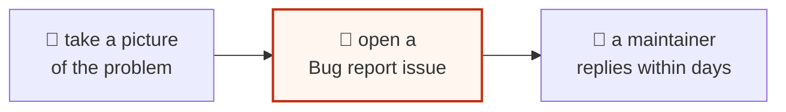

# 🩹 Troubleshooting

The five most common bumps — and the one-line fixes.

---

## 1 · "It won't scan — try more Fade…"

```
  what's happening             the fix
  ─────────────────            ────────────────────────────────────
  the picture is too loud      slide Fade up (try 40–60%)
  for the dots to win          or press the ✨ "Fix it for me" button
```

The studio even offers a one-tap rescue button right on the warning row.

## 2 · The picture looks broken into blobs

```
  what's happening             the fix
  ─────────────────            ────────────────────────────────────
  the dither is doing its      that's normal at small sizes!
  job at tiny resolution       → switch Edge style to "Screen" for
                                 clean halftone dots
                               → or make "How big" smaller
```

## 3 · My SVG/PNG won't download

```
  ✓ check the browser isn't blocking downloads (look for a 🚫 in the bar)
  ✓ try "Save SVG" instead — it always works offline
  ✓ private/incognito windows sometimes block big files — use a normal one
```

## 4 · The studio looks wrong after an update

```
  the old copy is cached       the fix
  ─────────────────────        ────────────────────────
  browser shows stale files    press Ctrl+Shift+R (or Cmd+Shift+R)
                               to force a fresh load
```

## 5 · My saved builds disappeared

```
  saved builds live in the browser's own memory drawer (localStorage).
  they vanish if:
   ✗ the browsing data was cleared
   ✗ a different browser/profile is used
   ✗ "Clear all" was pressed
  they do NOT vanish when the tab closes — that's safe.
```

---

## Still stuck?



The **Bug report** form (under Issues) asks friendly questions — no technical
words required. Pictures of the problem help enormously.
